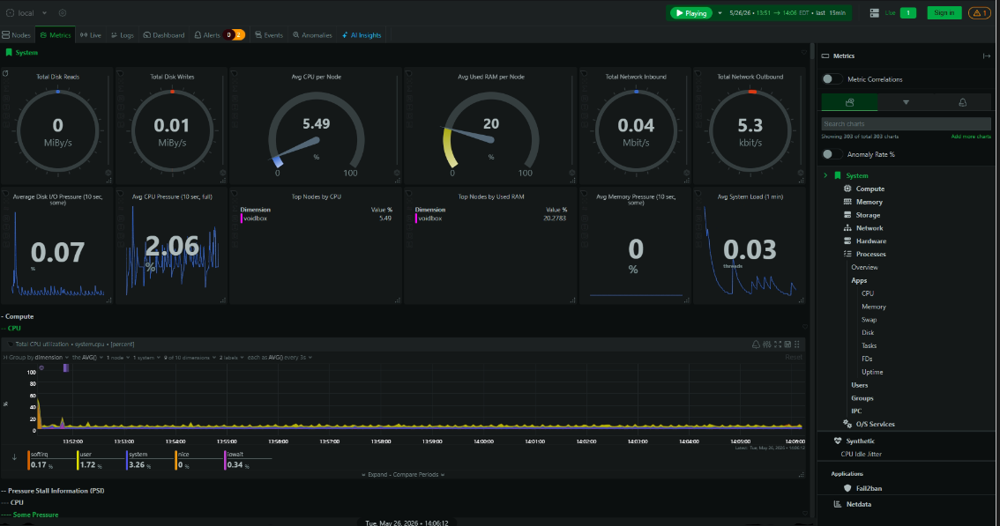
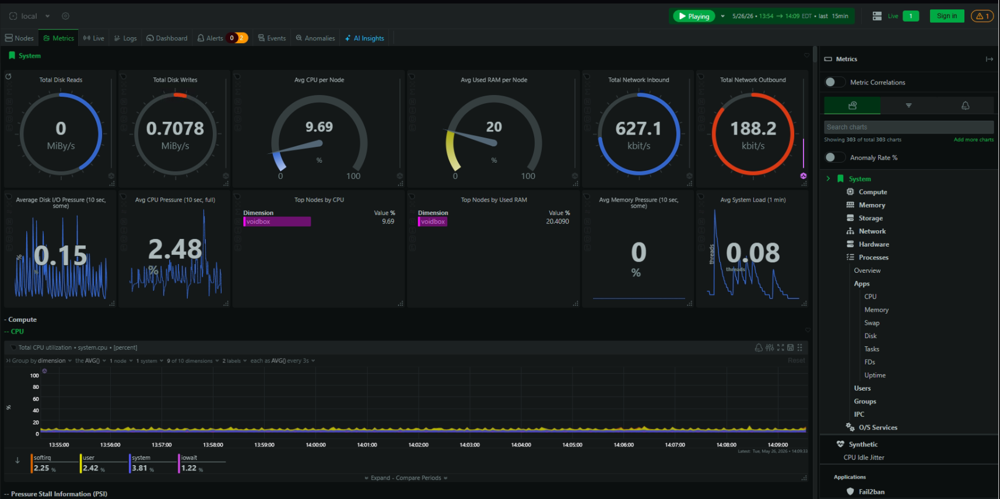
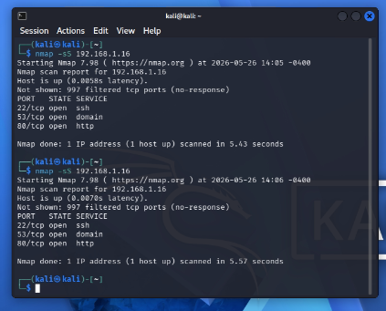

#Home SOC Lab – Network Monitoring & Attack Simulation

This project is a self-built home lab designed to simulate attacker behavior and observe system and network responses in real time. The lab focuses on DNS monitoring, system telemetry, and basic intrusion detection using lightweight tools.

##Objective
Build a functional home lab to simulate common attacker behaviors
Monitor system and network responses using real-time telemetry
Develop foundational SOC analysis skills through hands-on testing
Understand the impact of reconnaissance and authentication attacks on system performance

##Lab Architecture

Attacker:

Kali Linux VM (VirtualBox)

Target / Monitoring Node:

Ubuntu-based server ("voidbox")

Network Components:

AdGuard Home – DNS filtering and query logging
Netdata – real-time system monitoring
WireGuard – secure remote access
fail2ban – intrusion prevention

##Tools Used

Kali Linux – attack simulation
Nmap – network scanning and reconnaissance
AdGuard Home – DNS monitoring and filtering
Netdata – system and performance monitoring
fail2ban – intrusion detection and response
WireGuard – VPN for secure remote access
VirtualBox – virtualization platform
Reconnaissance Testing (Nmap)

Performed network scans against the target system:

nmap -sS (stealth scan)
nmap -A (aggressive scan)
Observations
Aggressive scans caused significant CPU and network spikes
Stealth scans resulted in lower, sustained system pressure over time
Netdata visualized real-time CPU, network, and disk impact

##System Monitoring

Used Netdata to observe:

CPU usage and load average
Network traffic spikes during scans
Disk I/O increases during sustained activity
System pressure metrics under load
Key Insight

Different attack types produce distinct system behavior patterns.

### Baseline System State

Before scan testing, the monitoring node showed low CPU usage, low system load, and normal network activity.

### Stealth Scan Observation

The TCP SYN scan produced lower, sustained system activity with visible CPU pressure and disk I/O changes.

### Aggressive Scan Observation

The aggressive Nmap scan produced a larger increase in CPU usage, network throughput, and system activity compared to the stealth scan.

### Nmap Scan Output

The scan identified exposed services on the monitoring node, including SSH, DNS, and HTTP.

##DNS Monitoring (AdGuard)

Analyzed DNS queries to identify device behavior:

Identified smart home devices by traffic patterns
Correlated DNS activity with network spikes
Observed high-frequency query behavior from mobile devices
Example

Amazon API traffic was used to identify an Alexa device without hostname data.

Key Insight

DNS traffic can be used to profile device behavior and identify unknown endpoints on a network.

##Authentication & Intrusion Detection

Simulated failed SSH login attempts:

Observed authentication logs in /var/log/auth.log
Verified fail2ban detection and response
Confirmed IP banning behavior
Key Insight

Repeated authentication failures generate identifiable log patterns and can trigger automated defensive responses.

##Challenges & Lessons Learned
Wazuh deployment failed due to hardware limitations (4GB RAM, limited disk space)
Identified resource constraints using system monitoring tools
Learned to separate lightweight monitoring from heavy SIEM solutions
Gained understanding of CPU pressure, memory usage, and disk utilization under load
Recognized differences between loud vs. stealthy attack behavior

##Future Improvements
Deploy Wazuh or SIEM on dedicated hardware
Expand monitoring to additional endpoints
Implement alerting for abnormal system behavior
Simulate more advanced attack scenarios
